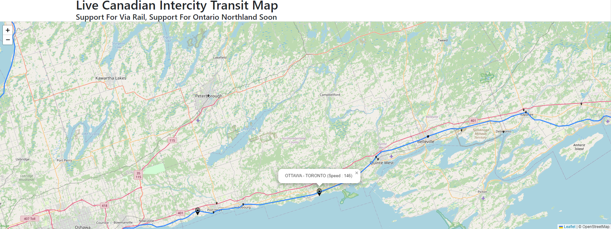

# Live-Intercity-Transit
Live Intercity Transit Map for Canada

## Support
Currently, the project supports VIA rail stations and trains as well as Ontario Northland Stations (Polar Bear Express).
ONR does not supply live realtime data so support is coming, but in a preliminary stage.

## Structure
Java Backend with static data stored on a MySQl server. 
Live data is served by timed AJAX calls.

## Demo

> * Live updates are refreshed every 10 seconds
> * Trains that have recently arrived or departed from stations are displayed
> * Train speed, destination, and origin are displayed
> * Every station is marked using a pin icon and train route terminals are indicated by major icons
> * All routes are highlighted in blue and scale for visibility

## Release Date
This project is currently in the preliminary development phase. There is currently no guidelines set for a release date.

## Author
Colin McCormack
